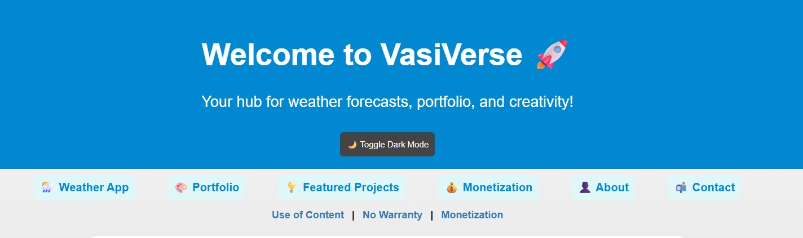

# 🌌 VasiVerse

  

> "A universe of ideas, creativity, and innovation.  
> This repository is a space for exploration, experimentation, and building something extraordinary."

---

---

## 🔭 What is VasiVerse?

**VasiVerse** is my personal web lab — a responsive, dark-mode-ready HTML/CSS/JS universe that includes:

- 🌤️ Real-time weather app with OpenWeather API  
- 🔐 VaultVerse — offline password tool with QR  
- 🎯 Mobile-first layout with smooth scroll & fade-in animations  
- 🌓 Dark/light toggle theme  
- 📬 Contact & About pages with personality  
- ⚖️ Privacy-first: AdSense-ready, GDPR-aware, and 100% static

---

## 🚀 Getting Started

1. Clone the repo:  
   `git clone https://github.com/vasilisnikitaras/VasiVerse.git`

2. Open `index.html` in your browser  
3. Customize content (avatar, colors, footer links etc.)

📦 Or visit it live → **[https://vasilisnikitaras.github.io/VasiVerse](https://vasilisnikitaras.github.io/VasiVerse)**

---

## 📂 Project Structure

